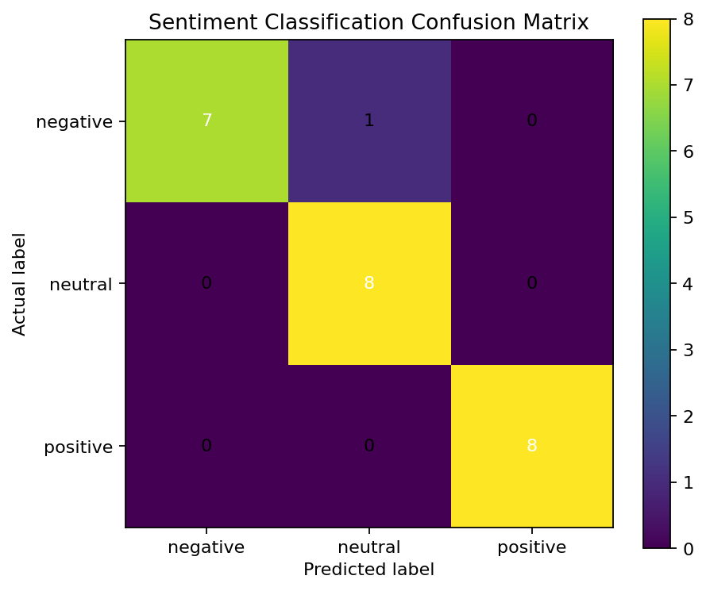

# Financial Sentiment Analysis

A reproducible financial-text classification project comparing a deterministic baseline, VADER, and FinBERT-compatible inference.

## Why this project

Financial language is domain-specific. Words such as *loss*, *cut*, *beat*, and *pressure* can materially change the interpretation of an earnings headline. This repository demonstrates how to:

- structure labelled financial text for model evaluation;
- implement interchangeable sentiment-model adapters;
- compare predictions using accuracy, macro-F1, class-level metrics, and confusion matrices;
- separate a lightweight reproducible baseline from an optional transformer model;
- package analysis code with tests and continuous integration.

## Current reproducible result

The committed sample contains **24 labelled financial headlines**, balanced across positive, neutral, and negative classes.

The deterministic baseline currently achieves:

| Metric | Value |
|---|---:|
| Accuracy | 0.958 |
| Macro-F1 | 0.958 |
| Observations | 24 |

These figures are **demonstration results on a small, curated sample**, not estimates of production performance. The sample is included to make the repository executable without external data or model downloads.



## Models

### 1. Rule-based baseline

A deterministic financial lexicon provides a transparent reference model and keeps the repository runnable in constrained environments.

### 2. VADER

VADER supplies a general-purpose sentiment baseline. It is useful for testing whether a finance-specific transformer provides material improvement over a conventional lexicon model.

### 3. FinBERT

The `FinBERTAnalyzer` uses `ProsusAI/finbert` through Hugging Face Transformers. Model weights are downloaded when FinBERT is run and are not committed to this repository.

## Repository structure

```text
.
├── .github/workflows/ci.yml
├── data/sample_financial_text.csv
├── notebooks/financial_sentiment_analysis.ipynb
├── results/
│   ├── rule_based_confusion_matrix.png
│   ├── rule_based_metrics.json
│   └── rule_based_predictions.csv
├── scripts/run_analysis.py
├── src/financial_sentiment/
│   ├── cli.py
│   ├── models.py
│   ├── pipeline.py
│   └── visualization.py
├── tests/
├── pyproject.toml
├── requirements.txt
└── requirements-finbert.txt
```

## Installation

### Lightweight environment

```bash
python -m venv .venv
source .venv/bin/activate  # Windows: .venv\Scripts\activate
pip install -e ".[dev]"
```

### FinBERT environment

```bash
pip install -e ".[dev,finbert]"
```

## Usage

Run the reproducible baseline:

```bash
financial-sentiment --model rule
```

Run VADER:

```bash
financial-sentiment --model vader
```

Run FinBERT:

```bash
financial-sentiment --model finbert --batch-size 16
```

Equivalent module command:

```bash
python -m financial_sentiment.cli --model rule
```

## Evaluation design

The pipeline reports:

- overall accuracy;
- macro-F1, which weights each sentiment class equally;
- weighted F1;
- class-specific precision, recall, and F1;
- a fixed-order confusion matrix for negative, neutral, and positive labels.

For a larger study, the next step is to use a time-based train/evaluation split or an externally labelled benchmark, then quantify uncertainty with bootstrap confidence intervals. Model comparison should also include error analysis by source, company, event type, and headline length.

## Limitations

- The committed dataset is deliberately small and curated.
- The rule-based model is a transparent baseline, not a production system.
- VADER is not specialised for financial language.
- FinBERT inference may vary with package and model versions unless the environment is fully locked.
- Headline sentiment is not equivalent to future return prediction or investment advice.

## Tests

```bash
pytest -q
```

GitHub Actions runs the tests on Python 3.10, 3.11, and 3.12 and executes the deterministic baseline after each push or pull request.

## Potential extensions

1. Add a larger externally sourced and properly licensed dataset.
2. Compare VADER and FinBERT with bootstrap confidence intervals.
3. Analyse model disagreement and calibration.
4. Add entity extraction and event-type tagging.
5. Evaluate whether sentiment features improve a downstream forecasting model without look-ahead leakage.

## Author

**Erica Yang, Ph.D.**  
Data Scientist specialising in applied machine learning, statistical evaluation, experimentation, and model reliability.
